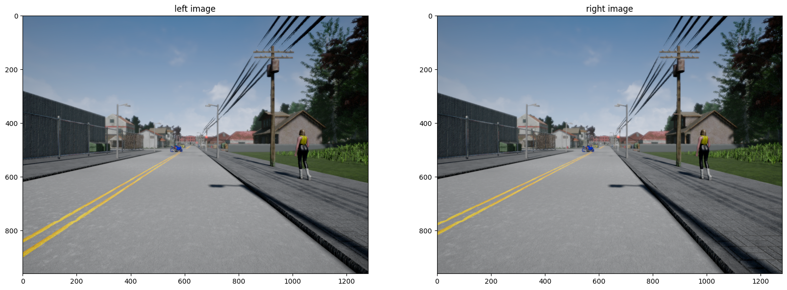

# Self-Driving Cars: Projects & Assignments

This repository contains a collection of projects and assignments focused on **Autonomous Driving Systems**, covering fundamental concepts such as perception, mapping, localization, planning, and control. Each module is implemented in Python or Jupyter Notebooks, with the goal of building intuition and practical understanding of how self-driving cars operate.

---

## Projects

### Perception
- **Applying Stereo Depth to a Driving Scenario**  
  Estimate depth from stereo images to perceive the 3D structure of the environment.
    - Stereo Left and Right Image:
      
    - Stereo Disparity Map:
      
    - Stereo Depth Map:
      
    - Object To Detect:
      
    - Location of the object in the image:
      
    - Identification of object in Image:
      
  
- **Lidar Parameter Estimation and Plane Fitting**  
  Extract ground planes and environmental features from LiDAR point clouds.

---

### Mapping
- **Occupancy Grid Mapping Using Inverse Measurement Model**  
  Implement probabilistic occupancy grid mapping for environment representation using Lidar Data.
  - Actual Environment where vehicle navigates:
  
  - What vehicles captures at every step about Environment:
  
  - How occupancy grid is constructed as time progress:
  

---

### Localization
- **Extended Kalman Filter**  
  Apply EKF for state estimation of a vehicle navigating through uncertain environments.

---

### Vehicle Dynamics & Control
- **Longitudinal Vehicle Model**  
  Model the longitudinal dynamics (acceleration/braking) of a car.
    - We will now drive the vehicle over a slope as shown in the diagram below:
    
    - To climb the slope, a trapezoidal throttle input is provided for the next 20 seconds as shown in the figure below:
    
    - After applying the throttle to the vehicle Longitudinal model we get the following about position of vehicle at every time step:
    

- **Kinematics Bicycle Model**  
  Explore the kinematic bicycle model for lateral vehicle motion.
    - Circle Path With Slip Angle:
    
    - Circle Path Without Slip Angle:
    
    - Square Path With Slip Angle:
    
    - Square Path Without Slip Angle:
    
    - Spiral Path With Slip Angle:
    
    - Figure 8 Path With Slip Angle:
    

---

### Planning
- **Mission Planning**  
  Design algorithms like Dijkstra’s and $A^*$ for high-level route and trajectory shortest path planning in Berkeley, California.
  - Networkx Libraries Shortest Path for Reference:
  
  - Dijkstra's Shortest Path:
  
  - $A^*$ Shortest Path:
  

---

### Estimation & Learning
- **Ordinary Least Squares**  
  Apply OLS regression for parameter estimation tasks in driving scenarios.  

- **Recursive Least Squares**  
  Implement RLS for online, adaptive parameter estimation.